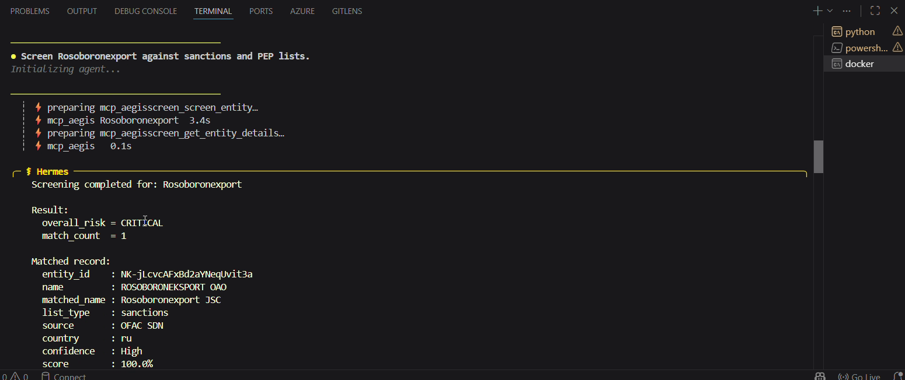

# 🛡️ AegisScreen — Trade Sanctions & PEP Screening Agent

> An autonomous **Hermes Agent** that screens companies and individuals against **real sanctions and PEP data** through a custom **Model Context Protocol (MCP)** server — with fuzzy + phonetic name matching, risk scoring, and explainable match confidence.

**Portfolio Project 12** · Trade-compliance / RegTech domain — sanctions screening, PEP due-diligence, and sanctions-circumvention checks.

---

## 🎥 See it in action (1-minute demo)

[](https://github.com/alihaider678/ai-portfolio-projects/blob/main/12_Sanctions_PEP_Screening_Agent/assets/hermes-mcp-demo.mp4)

**▶️ Click the image above to play the demo.** In it, the **Hermes Agent** (running in Docker) is asked in plain English to *"Screen Rosoboronexport against sanctions and PEP lists."* It then **autonomously discovers and calls the MCP screening tools** (`screen_entity`, `get_entity_details`) and returns a **CRITICAL** risk assessment backed by real OFAC data — then does a batch screen that correctly flags Putin & Kim Jong Un while clearing a legitimate company.

*(The video file also lives in [`assets/hermes-mcp-demo.mp4`](assets/hermes-mcp-demo.mp4).)*

---

## 🌐 Live demo

- **🖥️ Web dashboard:** **[aegisscreen.vercel.app](https://aegisscreen.vercel.app)**
- **⚙️ Backend API:** [aegisscreen-backend.onrender.com/api/health](https://aegisscreen-backend.onrender.com/api/health)

The live site is the **web-dashboard** front door (see architecture below). Type a company or person's name and get an instant risk verdict with the matching records, scores, and an explanation of *why* it matched.

> ⚠️ The backend runs on a free tier that sleeps after ~15 min idle, so the **first** screening after a nap may take ~30–50 s to wake up. After that it's fast.

---

## ❓ What is this? (in plain English)

**The problem.** Before a company can trade internationally, it must check that its customers, suppliers, and shipment parties are **not on a sanctions list** and are not high-risk **Politically Exposed Persons (PEPs)**. This is hard because the same sanctioned entity shows up under **dozens of spellings, transliterations, and aliases** — *"Rosoboronexport"* vs *"ROSOBORONEKSPORT OAO"*, or *"Muhammad" / "Mohammed" / "Mohamad."* A plain exact-match check misses them; a naïve fuzzy check drowns you in false positives on generic words like *"Shipping"* or *"Trading."*

**What AegisScreen does.** It screens any name against **real government data** (OFAC sanctions + OpenSanctions PEP data) using a tuned **two-stage fuzzy + phonetic** matching engine, returns a **risk level** (LOW → CRITICAL) with a **confidence score**, and **explains the match**. It's exposed two ways: as an **AI-agent tool** (MCP) and as a **web API + dashboard**.

**What is MCP?** The **Model Context Protocol** is an open standard — think of it as a *"USB port for AI agents."* You build a tool server once, and *any* MCP-compatible AI agent can automatically **discover** and **call** its tools. Here, the screening engine is wrapped as an MCP server, so an agent can use it without any custom glue code.

**What is the Hermes Agent?** [Hermes Agent](https://nousresearch.com) (by Nous Research) is a self-hosted autonomous AI agent that runs in Docker. It's **MCP-native** — you register a tool server and it decides, on its own, when to call which tool to satisfy a request. In this project, Hermes is the "brain" that reads a plain-English screening request and drives the MCP tools.

---

## 🧠 How it works — step by step

```
                         ┌──────────────────────────────────────────────┐
                         │   Screening engine  (mcp_server/matcher.py)    │
                         │   two-stage fuzzy + phonetic matching,         │
                         │   risk scoring, explanations                   │
                         └──────────────────────────────────────────────┘
                              ▲                              ▲
                   REST call  │                              │  MCP protocol
                              │                              │
                   ┌──────────┴───────────┐      ┌───────────┴────────────┐
                   │  FastAPI backend      │      │  MCP server            │
                   │  (port 8010)          │      │  (port 8020)           │
                   └──────────┬───────────┘      └───────────┬────────────┘
                              │                              │
                   ┌──────────┴───────────┐      ┌───────────┴────────────┐
                   │  Next.js web UI       │      │  Hermes Agent (Docker) │
                   │  → the LIVE web app   │      │  → the DEMO video      │
                   └──────────────────────┘      └────────────────────────┘

                              └───────────────┬──────────────┘
                                   both read the SAME real data:
                              OFAC SDN  +  OpenSanctions (sanctions + PEP)
```

1. **Ingest the data** — `ingest.py` downloads the OFAC SDN sanctions list and OpenSanctions PEP data, normalizes them, and caches them locally (a production-accurate "synced watchlist" pattern).
2. **Screen a name** — the engine (`matcher.py`) runs a **two-stage match**: a fast recall pass (`token_set_ratio` + a no-space ratio) gathers candidates, then a strict rerank (`token_sort_ratio` + no-space ratio) plus a **Metaphone phonetic** rescue and an **IDF distinctive-token gate** (which down-weights generic words like *"shipping"*) decide the final score. It returns a risk band and a plain explanation.
3. **Expose it over MCP** — `server.py` wraps the engine as an MCP server (`aegisscreen`) with three tools: `screen_entity`, `batch_screen`, `get_entity_details`.
4. **Hermes drives it** — the Hermes Agent (Docker) is pointed at the MCP server. When asked to screen a party in plain English, it **discovers and calls** these tools on its own and reasons about the result. *(This is the MCP + Hermes proof shown in the video.)*
5. **Also a normal web app** — in parallel, a **FastAPI** service wraps the same engine as a REST API, and a **Next.js** dashboard calls it — so the product works instantly in a browser, with or without the agent running.

> **The key idea:** *one screening engine, two front doors.* The MCP server proves the **agentic** skill; the REST API + web UI is the **product**.

---

## ⚙️ Run it yourself

**Prerequisites:** Python 3.11, Node.js 18+, and (for the agent demo) Docker Desktop.

```bash
# 0. Create the Python env and install deps
python -m venv .venv
.venv\Scripts\pip install -r mcp_server/requirements.txt -r backend/requirements.txt

# 1. Download & cache the real datasets (OFAC + OpenSanctions PEP)
.venv\Scripts\python mcp_server/ingest.py

# 2a. Run the MCP server (for the Hermes agent) — HTTP mode
.venv\Scripts\python mcp_server/server.py --http --port 8020

# 2b. …or run the REST API (for the web app)
.venv\Scripts\python -m uvicorn backend.main:app --port 8010

# 3. Run the web dashboard
cd frontend && npm install && npm run dev      # http://localhost:3000
```

- **Agent (MCP + Hermes) setup:** full tested runbook in [`hermes/README.md`](hermes/README.md).
- **Engine / MCP server details:** [`mcp_server/`](mcp_server/).

---

## 🧩 Tech stack

| Layer | Technology |
|-------|-----------|
| Agent framework | **Hermes Agent** (Nous Research, self-hosted via Docker) |
| Tool protocol | **MCP** (Model Context Protocol — official `mcp` Python SDK / FastMCP) |
| Data | OFAC SDN + OpenSanctions (sanctions + PEP), ingested & normalized locally |
| Matching engine | RapidFuzz (two-stage `token_set_ratio` → `token_sort_ratio` + no-space rerank), Metaphone phonetic rescue (jellyfish), IDF distinctive-token gate, length guard |
| Backend | FastAPI (Python 3.11) |
| Frontend | Next.js + TypeScript + Tailwind (theme-aware, dark/light) |

**Possible extensions (not yet built):** episodic agent memory in a vector DB (Qdrant/Pinecone) and observability/eval tracing (LangSmith / W&B).

---

## 📁 Project structure

```
12_Sanctions_PEP_Screening_Agent/
├── mcp_server/          # Custom MCP screening server + core engine
│   ├── ingest.py        # Download & normalize OFAC + OpenSanctions data
│   ├── matcher.py       # Two-stage fuzzy + phonetic matching, risk scoring
│   ├── datastore.py     # Load normalized data, build search index (IDF stats)
│   └── server.py        # MCP server: screen_entity / batch_screen / get_entity_details
├── backend/             # FastAPI REST wrapper (reuses the engine)
├── frontend/            # Next.js web dashboard (single + batch screening)
├── hermes/              # Hermes Agent integration (config + tested runbook)
└── assets/              # Demo video + thumbnail
```

---

## 🗺️ Roadmap / what's next

- [x] Deploy the web dashboard live (Render + Vercel).
- [ ] Add episodic agent memory (vector DB) so Hermes remembers past screenings.
- [ ] Add an eval harness + observability tracing (LangSmith / W&B).
- [ ] Sibling projects: **HS/Commodity-Code Classifier** (RAG + MCP) and **Export-License Determination** (Hermes).

---

## ⚠️ Disclaimer

Portfolio demonstration using public data. **Not** a substitute for a licensed compliance program. Sanctions/PEP screening decisions must be reviewed by qualified compliance professionals against current regulations.