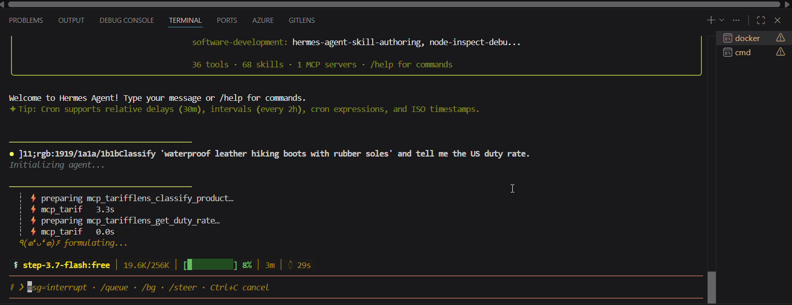

# 🔎 TariffLens — HS Code Classification & Duty Lookup Agent

> A hybrid-**RAG** agent that turns a plain-English product description into the correct **HS/HTS customs code** and its **US import duty rate** — retrieving over the real USITC tariff schedule, reranking with an LLM, and explaining its choice. Exposed as an **MCP** server and driven by the **Hermes Agent**.

**Portfolio Project 13** · Trade-compliance / RegTech domain — customs classification, tariff/duty determination.

> **New here?** Read **[❓ What is this?](#-what-is-this-in-plain-english)** for the problem → then **[🎥 watch the demo](#-see-it-in-action)** → then **[🌐 try the live app](#-live-demo)**.

---

## ❓ What is this? (in plain English)

**The problem.** Every product crossing a border must be classified with an **HS code** (Harmonized System) — a 6-to-10 digit number that determines the **customs duty** owed. Getting it wrong means overpaying duty or facing compliance penalties. But classification is genuinely hard: it hinges on a product's **material, construction, and use** (a knitted cotton t-shirt, a woven cotton shirt, and a leather boot all sit in different chapters), and the official schedule is tens of thousands of densely-worded lines.

**What TariffLens does.** You describe goods in plain English — *"waterproof leather hiking boots, rubber sole"* — and it returns the **suggested HS/HTS code**, a **confidence level**, a **plain-English justification**, and the **applicable US duty rate**. It's exposed two ways: as an **AI-agent tool** (MCP) and as a **web API + dashboard**.

**What is RAG?** *Retrieval-Augmented Generation* — instead of asking an LLM to recall codes from memory (unreliable), we **retrieve** the most relevant real tariff lines from an index and let the model reason **only over those**. TariffLens uses **hybrid retrieval**: BM25 keyword search + semantic vector search, fused together, then an LLM **reranker** picks the best code.

**What is MCP?** The **Model Context Protocol** — an open "USB port for AI agents." The classification engine is wrapped as an MCP server, so any MCP-compatible agent can **discover and call** its tools without custom glue.

**What is the Hermes Agent?** [Hermes Agent](https://nousresearch.com) (Nous Research) — a self-hosted, MCP-native autonomous agent (runs in Docker). It reads a plain-English request and decides which TariffLens tools to call.

---

## 🎥 See it in action

[](https://github.com/alihaider678/ai-portfolio-projects/blob/main/13_HS_Code_Classification_Agent/assets/hermes-mcp-demo.mp4)

**▶️ Click the image above to play the demo.** The **Hermes Agent** (in Docker) is asked in plain English to classify products and look up duties. It **autonomously discovers and chains the MCP tools** — e.g. `classify_product` *then* `get_duty_rate` — and returns reasoned answers: leather hiking boots → **6403.51**, an EV lithium-ion battery → **8507.60.00** (3.4%), a men's cotton t-shirt → **6109.10.00** (16.5%).

*(The video file also lives in [`assets/hermes-mcp-demo.mp4`](assets/hermes-mcp-demo.mp4).)*

---

## 🌐 Live demo

- **🖥️ Web dashboard:** **[tarifflens.vercel.app](https://tarifflens.vercel.app)**
- **⚙️ Backend API:** [tarifflens-backend.onrender.com/api/health](https://tarifflens-backend.onrender.com/api/health)

Type a product description and get its HS code, duty rate, justification, and the candidate codes the retriever considered.

> ⚠️ The backend runs on a free tier that sleeps after ~15 min idle, so the **first** classification after a nap may take ~30–50 s to wake up. After that it's fast.

---

## 🧠 How it works — step by step

```
                         ┌──────────────────────────────────────────────┐
                         │   TariffLens engine (mcp_server/engine.py)     │
                         │   hybrid retrieval → RRF fusion → LLM rerank   │
                         │   → duty lookup + justification                │
                         └──────────────────────────────────────────────┘
                              ▲                              ▲
                   REST call  │                              │  MCP protocol
                              │                              │
                   ┌──────────┴───────────┐      ┌───────────┴────────────┐
                   │  FastAPI backend      │      │  MCP server            │
                   │  (port 8011)          │      │  (port 8021)           │
                   └──────────┬───────────┘      └───────────┬────────────┘
                              │                              │
                   ┌──────────┴───────────┐      ┌───────────┴────────────┐
                   │  Next.js web UI       │      │  Hermes Agent (Docker) │
                   │  → the LIVE web app   │      │  → the DEMO video      │
                   └──────────────────────┘      └────────────────────────┘

                              └───────────────┬──────────────┘
                                    both use the SAME engine + data:
                                the real USITC Harmonized Tariff Schedule
```

1. **Ingest** — `ingest.py` downloads the official USITC HTS schedule and normalizes ~30k lines, building each code's **full nomenclature path** and inheriting **duty rates** across the 6-/8-/10-digit hierarchy.
2. **Index** — `build_index.py` embeds the 6- & 8-digit descriptions (OpenAI `text-embedding-3-small`, 512-dim) into a compact vector store.
3. **Retrieve (hybrid)** — for a query, run **BM25** (keyword) + **Chroma** (semantic) retrieval and merge them with **Reciprocal Rank Fusion (RRF)**.
4. **Rerank** — an **LLM reranker** reads the top fused candidates and returns the single best HS code + confidence + justification as **structured JSON**.
5. **Duty** — attach the US duty rate (resolving 10-digit statistical suffixes when a line has no rate of its own).
6. **Two front doors** — the same engine is served as **MCP tools** (for the Hermes Agent) and a **FastAPI REST API** (for the Next.js dashboard).

> **The key idea:** *retrieval for recall, reranking for precision.* Hybrid search casts a wide net; the LLM reranker + justification makes the final pick trustworthy.

---

## ⚙️ Run it yourself

**Prerequisites:** Python 3.11, Node.js 18+, an `OPENAI_API_KEY`, and (for the agent demo) Docker Desktop.

```bash
# 0. Env + deps
python -m venv .venv
.venv\Scripts\pip install -r mcp_server/requirements.txt -r backend/requirements.txt
copy .env.example .env      # then add your OPENAI_API_KEY

# 1. Download the tariff data + build the embeddings (one-time)
.venv\Scripts\python mcp_server/ingest.py
.venv\Scripts\python mcp_server/build_index.py

# 2a. MCP server (for Hermes) — HTTP mode
.venv\Scripts\python mcp_server/server.py --http --port 8021

# 2b. …or the REST API (for the web app)
.venv\Scripts\python -m uvicorn backend.main:app --port 8011

# 3. Web dashboard
cd frontend && npm install && npm run dev      # http://localhost:3000
```

- **Agent (MCP + Hermes) setup:** full runbook in [`hermes/README.md`](hermes/README.md).

---

## 🧩 Tech stack

| Layer | Technology |
|-------|-----------|
| Agent framework | **Hermes Agent** (Nous Research, self-hosted via Docker) |
| Tool protocol | **MCP** (Model Context Protocol — `mcp` Python SDK / FastMCP) |
| Retrieval | **Hybrid**: BM25 (`rank-bm25`) + dense embeddings, fused with **Reciprocal Rank Fusion** |
| Vector store | **Chroma** (built in-memory from committed embeddings) |
| Embeddings / rerank | **OpenAI** `text-embedding-3-small` (512-dim) + LLM reranker with structured JSON output |
| Data | **USITC Harmonized Tariff Schedule** (public), ~30k lines, with duty rates |
| Backend | FastAPI (Python 3.11) |
| Frontend | Next.js + TypeScript + Tailwind (theme-aware, dark/light) |

---

## 📁 Project structure

```
13_HS_Code_Classification_Agent/
├── mcp_server/          # Engine + MCP server
│   ├── ingest.py        # Download & normalize the USITC HTS schedule
│   ├── datastore.py     # HTS records, BM25 index, duty resolution
│   ├── build_index.py   # Embed descriptions -> embeddings.npy
│   ├── engine.py        # Hybrid retrieval + RRF + LLM rerank + duty lookup
│   └── server.py        # MCP server: classify_product / get_duty_rate / get_hs_details
├── backend/             # FastAPI REST wrapper (reuses the engine)
├── frontend/            # Next.js dashboard (classify + duty + candidates)
└── hermes/              # Hermes Agent integration (config + runbook)
```

---

## 🗺️ Roadmap / what's next

- [x] Deploy the web dashboard live (Render + Vercel).
- [x] Record the Hermes + MCP demo.
- [ ] Multi-country duty lookup (WTO Tariff Download Facility) beyond the US.
- [ ] Add a cross-encoder reranker + a classification eval set (accuracy@k).

---

## ⚠️ Disclaimer

Portfolio demonstration using public data (USITC Harmonized Tariff Schedule). Suggested HS codes and duty rates are **for guidance only** — final classification must be confirmed with a licensed customs broker or the relevant authority.